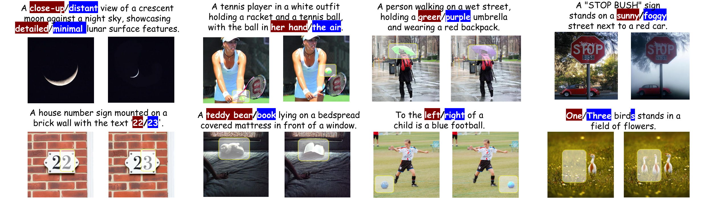
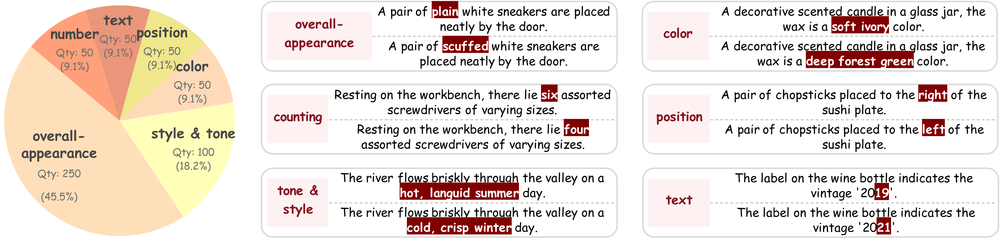
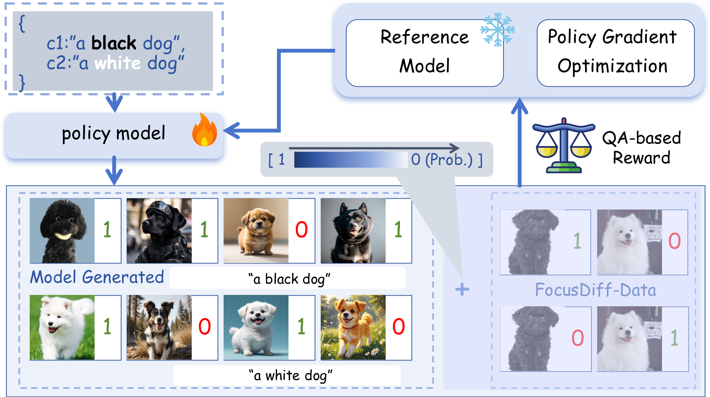
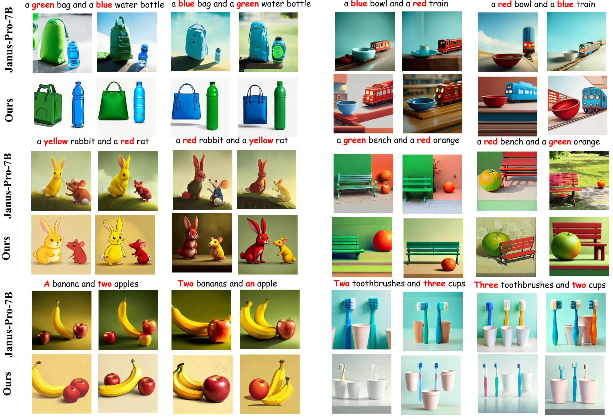
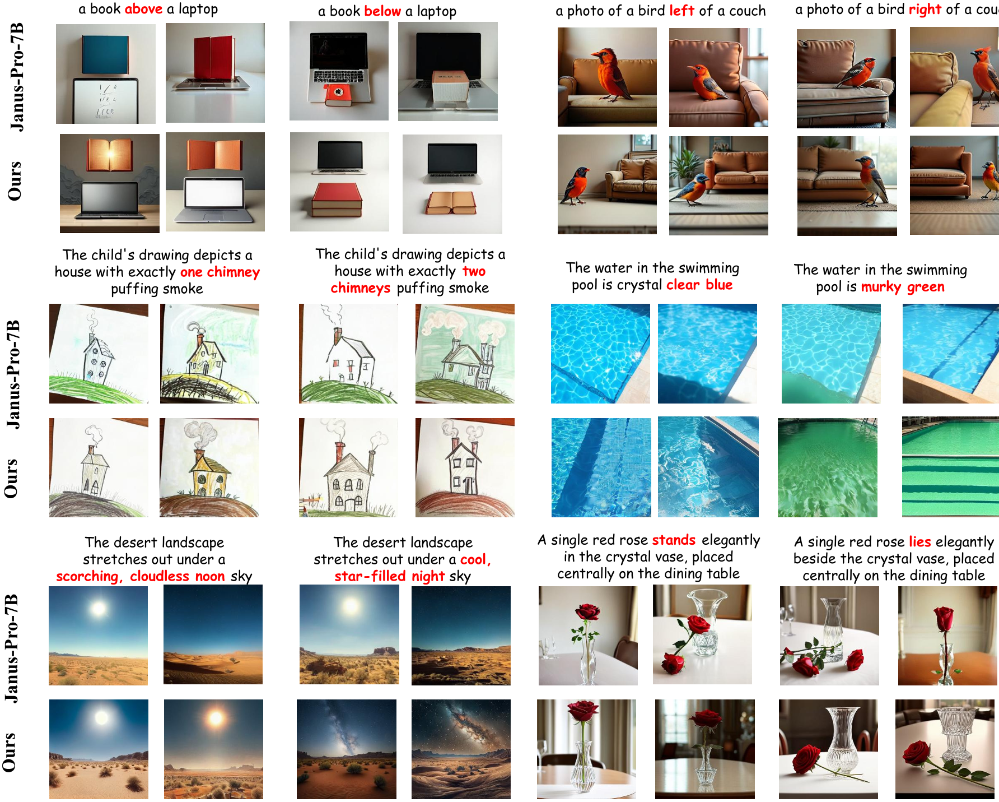
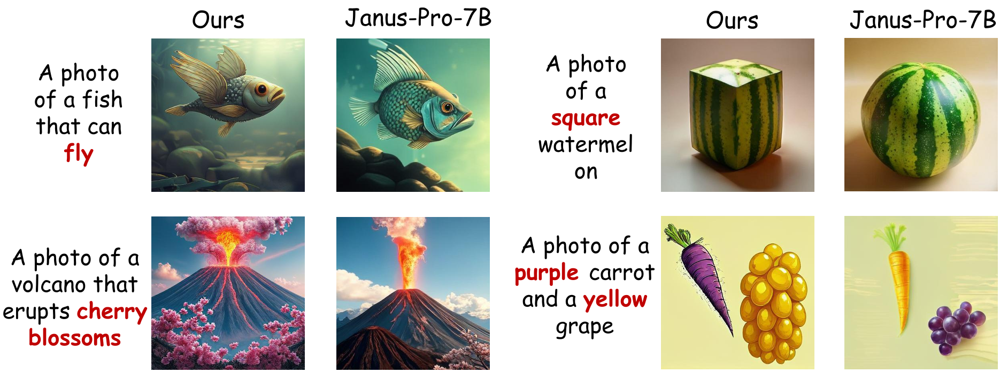

<h2 align="center" style="line-height: 25px;">
  
  FocusDiff: Advancing Fine-Grained Text-Image Alignment for Autoregressive Visual Generation through RL
</h2>

<p align="center">
  <a href="https://arxiv.org/abs/2506.05501">
    
  </a>
  <a href="https://focusdiff.github.io/">
    
  </a>
  <a href="https://github.com/wendell0218/FocusDiff">
    
  </a>
  <a href="https://huggingface.co/wendell0218/Janus-FocusDiff-7B">
    
  </a>
  <a href="https://huggingface.co/datasets/midbee/FocusDiff-Data-Subset">
    
  </a>
</p>

<div align="center">
Kaihang Pan<sup>1*</sup>, Wendong Bu<sup>1*</sup>, Yuruo Wu<sup>1*</sup>, Yang Wu<sup>2</sup>, Kai Shen<sup>1&ddagger;</sup>, Yunfei Li<sup>2</sup>,
 
Hang Zhao<sup>2</sup>, Juncheng Li<sup>1&dagger;</sup>, Siliang Tang<sup>1</sup>, Yueting Zhuang<sup>1</sup>

<sup>1</sup>Zhejiang University, <sup>2</sup>Ant Group

\*Equal Contribution, <sup>&ddagger;</sup>Project Leader, <sup>&dagger;</sup>Corresponding Authors

</div>



## 🔥 News
- **[June 21, 2025]** We have released [Janus-FocusDiff checkpoint](https://huggingface.co/wendell0218/Janus-FocusDiff-7B) and inference scripts. Besides, we also release a subset of [FocusDiff-Data](https://huggingface.co/datasets/midbee/FocusDiff-Data-Subset). Try it out now!
- **[June 13, 2025]** We have released PairComp benchmark and leaderboard.
- **[June 5, 2025]** Our paper is now available on arXiv: [FocusDiff: Advancing Fine-Grained Text-Image Alignment for Autoregressive Visual Generation through RL](https://arxiv.org/abs/2506.05501).


## 📝 TODO
- [x] Release the paper
- [x] Release PairComp Benchmark
- [x] Release Janus-FocusDiff checkpoint
- [x] Release training/inference scripts
- [x] Release training data

## 🚀 Overview

**FocusDiff** is a new method for improving fine-grained text-image alignment in autoregressive text-to-image models. By introducing the **FocusDiff-Data** dataset and a novel **Pair-GRPO** reinforcement learning framework, we help models learn subtle semantic differences between similar text-image pairs. Based on paired data in FocusDiff-Data, we further introduce the **PairComp** Benchmark, which focuses on subtle semantic differences.

Key Contributions:
1. **PairComp Benchmark**: A new benchmark focusing on fine-grained differences in text prompts.

    

2. **FocusDiff Approach**: A method using paired data and reinforcement learning to enhance fine-grained text-image alignment.

   <div style="text-align: center;">
       
   </div>

3. **SOTA Results**: Our model is evaluated with the top performance on multiple benchmarks including **GenEval**, **T2I-CompBench**, **DPG-Bench**, and our newly proposed **PairComp** benchmark.

Below is the organized file folder structure with brief descriptions:

```text
FocusDiff/
├── inference/          # Inference of text-to-image generation for Janus-FocusDiff
├── openr1-focusdiff/   # Training of Pair-GRPO
├── PairComp/           # Detailed instructions for PairComp benchmarking
```

## ⚔️ PairComp Leaderboarder

Each test case in Paircomp contains two similar prompts with subtle differences. By comparing the accuracy of the images generated by the model for each prompt, we evaluate whether the model has focused on the fine-grained semantic differences in the prompts to produce the corresponding correct images. More details are shown in [FocusDiff/PairComp](PairComp).

Below is the Leaderboard of Paircomp.:

| Rank |                          Model                          | Model size | Arithmetic mean | Geometric mean |
| :--: | :-----------------------------------------------------: | :--------: | :-------------: | :------------: |
|  🏅️   |   [Janus-FocusDiff-7B](https://arxiv.org/abs/2506.05501)    |     7B       |      85.0       |      83.5      |
|  🥈   |         [SD3-Medium](https://arxiv.org/abs/2403.03206)         |      2B      |      84.4       |      81.4      |
|  🥉   |      [Sana-1.5](https://arxiv.org/abs/2501.18427)       |      4.8B      |      83.2       |      80.0      |
|  4   |       [T2I-R1](https://arxiv.org/abs/2505.00703)        |      7B      |      82.4       |      79.3      |
|  5   |    [Janus-Pro-R1](https://arxiv.org/abs/2506.01480)     |      7B      |      82.0       |      79.2      |
|  6   | [FLUX.1-dev](https://github.com/black-forest-labs/flux) |      12B      |      80.3       |      75.7      |
|  7   |       [BLIP3-o](https://arxiv.org/abs/2505.09568)       |      8B      |      79.3       |      75.5      |
|  8   |      [Infinity](https://arxiv.org/abs/2412.04431)       |      8B      |      77.0       |      72.7      |
|  9   |       [SEED-X](https://arxiv.org/abs/2404.14396)        |      17B      |      74.8       |      71.5      |
|  10  |    [Janus-Pro-7B](https://arxiv.org/abs/2501.17811)     |       7B     |      75.5       |      70.4      |
|  11  |  [Janus-FocusDiff-1B](https://arxiv.org/abs/2506.05501) |      1B      |      71.0       |      68.1      |
|  12  |        [Emu3](https://arxiv.org/abs/2409.18869)         |       8B     |      68.5       |      63.2      |
|  13  |    [PixArt-alpha](https://arxiv.org/abs/2310.00426)     |      0.6B      |      67.5       |      62.7      |
|  14  |    [Janus-Pro-1B](https://arxiv.org/abs/2501.17811)     |     1B       |      64.6       |      59.2      |
|  15  |       [Show-o](https://arxiv.org/abs/2408.12528)        |     1.3B       |      63.6       |      59.1      |
|  16  |       [VILA-U](https://arxiv.org/abs/2409.04429)        |      7B      |      62.9       |      58.0      |
|  17  |     [Janus-Flow](https://arxiv.org/abs/2411.07975)      |     1.3B       |      55.5       |      49.0      |
|  18  |     [VARGPTv1.1](https://arxiv.org/abs/2504.02949)      |      7B      |      53.6       |      48.3      |
|  19  |      [LLamaGen](https://arxiv.org/abs/2406.06525)       |     775M       |      49.1       |      42.3      |

## 💪 Training
First please clone our repo and prepare the python environment for inference. We recommend using Python>=3.10. 
```
git clone https://github.com/wendell0218/FocusDiff.git
cd FocusDiff

conda create -n focusdiff python=3.11
conda activate focusdiff
pip install -r requirements.txt
```

Then, in terms of file composition, [openr1-focusdiff/recipes](openr1-focusdiff/recipes) contains some configuration yml files for training, and [openr1-focusdiff/src](openr1-focusdiff/src) includes some training logic codes for PairComp. 
You can perform RL for **Text-to-Image Generation** using the following command:

```bash
cd FocusDiff/openr1-focusdiff/src/open_r1

export ACCELERATE_CONFIG=../../recipes/accelerate_configs/zero2.yaml
export GRPO_CONFIG=../../recipes/t2i/grpo.yaml
export NUM_PROCESSES=8

# training command for Pair GRPO
accelerate launch \
  --config_file $ACCELERATE_CONFIG \
  --num_processes $NUM_PROCESSES \
  grpo_pair.py \
  --config $GRPO_CONFIG
# training command for vanilla GRPO
accelerate launch \
  --config_file $ACCELERATE_CONFIG \
  --num_processes $NUM_PROCESSES \
  grpo_vanilla.py \
  --config $GRPO_CONFIG
```

A subset of FocusDiff-Data is released in [https://huggingface.co/datasets/midbee/FocusDiff-Data-Subset](https://huggingface.co/datasets/midbee/FocusDiff-Data-Subset).


For a more detailed introduction of training, please refer to [here](openr1-focusdiff/README.md).


## 🎨 Inference
First please clone our repo and prepare the python environment for inference. We recommend using Python>=3.10. 
```
git clone https://github.com/wendell0218/FocusDiff.git
cd FocusDiff

conda create -n focusdiff python=3.11
conda activate focusdiff
pip install -r requirements.txt
```

Of course, [requirements.txt](requirements.txt)contains some Python packages required for training. If you just want to use our trained Janus-FocusDiff for text-to-image inference, you can also refer to the Python environment installation instructions in [Janus-Pro](https://github.com/deepseek-ai/Janus) to prepare the environment.

Then please prepare the model Janus-FocusDiff-7B, which utilizes Janus-Pro-7B as the pretrained model for subsequent reinforcement learning. You can download the corresponding model from [🤗https://huggingface.co/wendell0218/Janus-FocusDiff-7B](https://huggingface.co/wendell0218/Janus-FocusDiff-7B/tree/main).

 Below, a Simple Inference Example of text-to-image generation is provided. Also, [FocusDiff/inference/infer_paircomp.py](inference/infer_paircomp.py) provides the inference script for our Janus-FocusDiff on PairComp.

```python
import os
import torch
import PIL.Image
import numpy as np
from transformers import AutoModelForCausalLM
from janus.models import MultiModalityCausalLM, VLChatProcessor

@torch.inference_mode()
def generate(
    mmgpt: MultiModalityCausalLM,
    vl_chat_processor: VLChatProcessor,
    prompt: str,
    temperature: float = 1.0,
    parallel_size: int = 4,
    cfg_weight: float = 5.0,
    image_token_num_per_image: int = 576,
    img_size: int = 384,
    patch_size: int = 16,
    img_top_k: int = 1,
    img_top_p: float = 1.0,
):
    images = []
    input_ids = vl_chat_processor.tokenizer.encode(prompt)
    input_ids = torch.LongTensor(input_ids)
    tokens = torch.zeros((parallel_size*2, len(input_ids)), dtype=torch.int).cuda()
    for i in range(parallel_size*2):
        tokens[i, :] = input_ids
        if i % 2 != 0:
            tokens[i, 1:-1] = vl_chat_processor.pad_id
    inputs_embeds = mmgpt.language_model.get_input_embeddings()(tokens) 
    generated_tokens = torch.zeros((parallel_size, image_token_num_per_image), dtype=torch.int).cuda()
    for i in range(image_token_num_per_image):
        outputs = mmgpt.language_model.model(inputs_embeds=inputs_embeds, use_cache=True, past_key_values=outputs.past_key_values if i != 0 else None)
        hidden_states = outputs.last_hidden_state
        logits = mmgpt.gen_head(hidden_states[:, -1, :])
        logit_cond = logits[0::2, :]
        logit_uncond = logits[1::2, :]
        logits = logit_uncond + cfg_weight * (logit_cond-logit_uncond)
        if img_top_k:
            v, _ = torch.topk(logits, min(img_top_k, logits.size(-1)))
            logits[logits < v[:, [-1]]] = float("-inf")
        probs = torch.softmax(logits / temperature, dim=-1)
        if img_top_p:
            probs_sort, probs_idx = torch.sort(probs,
                                            dim=-1,
                                            descending=True)
            probs_sum = torch.cumsum(probs_sort, dim=-1)
            mask = probs_sum - probs_sort > img_top_p
            probs_sort[mask] = 0.0
            probs_sort.div_(probs_sort.sum(dim=-1, keepdim=True))
            next_token = torch.multinomial(probs_sort, num_samples=1)
            next_token = torch.gather(probs_idx, -1, next_token)
        else:
            next_token = torch.multinomial(probs, num_samples=1)
        generated_tokens[:, i] = next_token.squeeze(dim=-1)
        next_token = torch.cat([next_token.unsqueeze(dim=1), next_token.unsqueeze(dim=1)], dim=1).view(-1)
        img_embeds = mmgpt.prepare_gen_img_embeds(next_token)
        inputs_embeds = img_embeds.unsqueeze(dim=1)
    dec = mmgpt.gen_vision_model.decode_code(generated_tokens.to(dtype=torch.int), shape=[parallel_size, 8, img_size//patch_size, img_size//patch_size])
    dec = dec.to(torch.float32).cpu().numpy().transpose(0, 2, 3, 1)
    dec = np.clip((dec + 1) / 2 * 255, 0, 255)
    visual_img = np.zeros((parallel_size, img_size, img_size, 3), dtype=np.uint8)
    visual_img[:, :, :] = dec
    for i in range(parallel_size):
        images.append(PIL.Image.fromarray(visual_img[i]))

    return images
  

if __name__ == "__main__":
    import argparse
    parser = argparse.ArgumentParser()

    parser.add_argument("--model_path", type=str, default="")
    parser.add_argument("--ckpt_path", type=str, default=None)
    parser.add_argument("--caption", type=str, default="a brown giraffe and a white stop sign")
    parser.add_argument("--gen_path", type=str, default='results/samples')
    parser.add_argument("--cfg", type=float, default=5.0)
    parser.add_argument("--parallel_size", type=int, default=4)

    args = parser.parse_args()
    vl_chat_processor: VLChatProcessor = VLChatProcessor.from_pretrained(args.model_path)
    vl_gpt: MultiModalityCausalLM = AutoModelForCausalLM.from_pretrained(args.model_path, trust_remote_code=True)
    if args.ckpt_path is not None:
        state_dict = torch.load(f"{args.ckpt_path}", map_location="cpu")
        vl_gpt.load_state_dict(state_dict)
    vl_gpt = vl_gpt.to(torch.bfloat16).cuda().eval()
    prompt = f'<|User|>: {args.caption}\n\n<|Assistant|>:<begin_of_image>'
    images = generate(
        vl_gpt,
        vl_chat_processor,
        prompt,
        parallel_size = args.parallel_size,
        cfg_weight = args.cfg, 
    )
    if not os.path.exists(args.gen_path):
        os.makedirs(args.gen_path, exist_ok=True)
    for i in range(args.parallel_size):
        img_name = str(i).zfill(4)+".png"
        save_path = os.path.join(args.gen_path, img_name)
        images[i].save(save_path)
```

## 📊 Main Results

- ### Robust Text-to-Image Generation
  
  

- ### Counterfactual Generation
  

## 🤝 Acknowledgment

Our project is developed based on the following repositories:

- [Janus-Series](https://github.com/deepseek-ai/Janus): Unified Multimodal Understanding and Generation Models
- [Open-R1](https://github.com/huggingface/open-r1): Fully open reproduction of DeepSeek-R1

## 📜 Citation

If you find this work useful for your research, please cite our paper and star our git repo:

```bibtex
@article{pan2025focusdiff,
  title={FocusDiff: Advancing Fine-Grained Text-Image Alignment for Autoregressive Visual Generation through RL},
  author={Pan, Kaihang and Bu, Wendong and Wu, Yuruo and Wu, Yang and Shen, Kai and Li, Yunfei and Zhao, Hang and Li, Juncheng and Tang, Siliang and Zhuang, Yueting},
  journal={arXiv preprint arXiv:2506.05501},
  year={2025}
}

@article{pan2025unlocking,
  title={Unlocking aha moments via reinforcement learning: Advancing collaborative visual comprehension and generation},
  author={Pan, Kaihang and Wu, Yang and Bu, Wendong and Shen, Kai and Li, Juncheng and Wang, Yingting and Li, Yunfei and Tang, Siliang and Xiao, Jun and Wu, Fei and others},
  journal={arXiv preprint arXiv:2506.01480},
  year={2025}
}
```