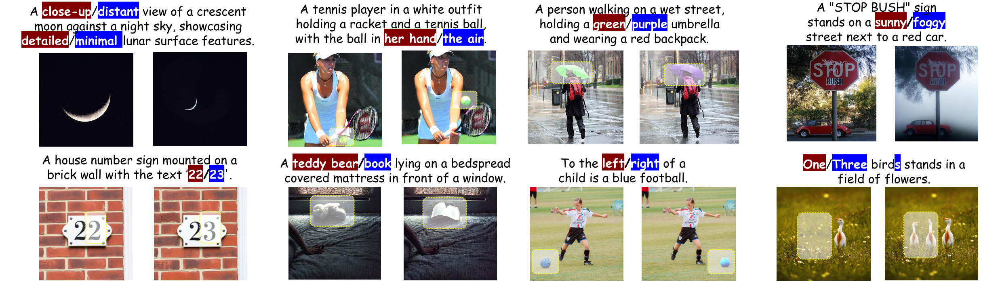
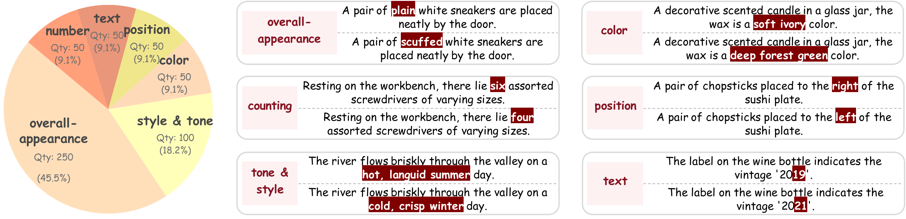
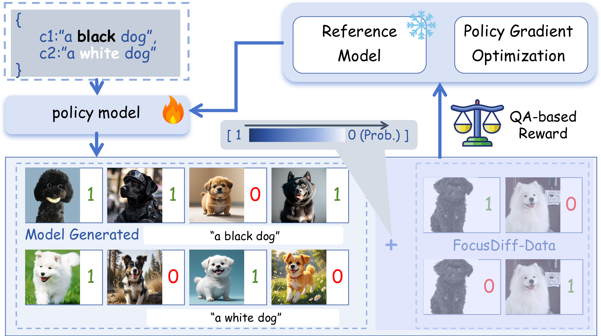
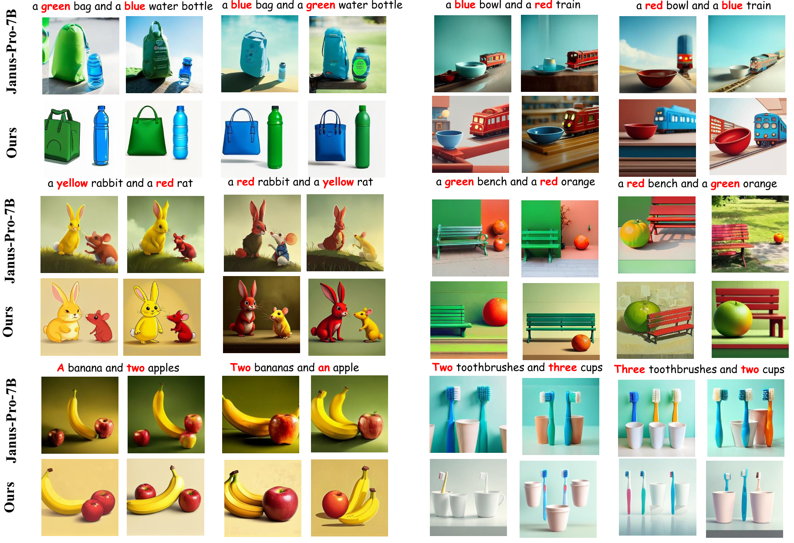
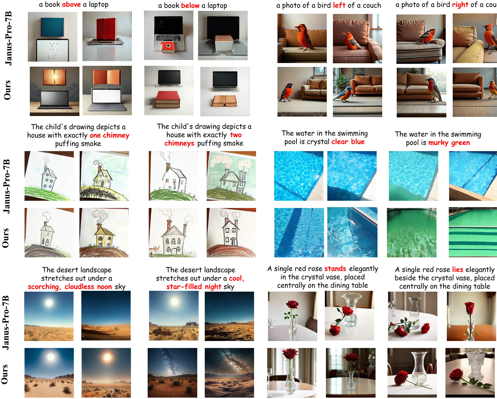
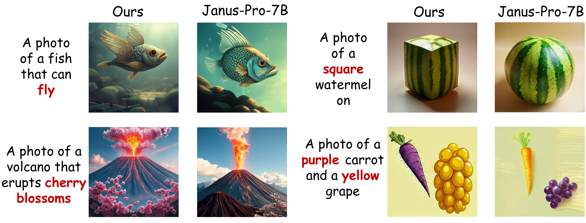

<h2 align="center" style="line-height: 25px;">
  
  FocusDiff: Advancing Fine-Grained Text-Image Alignment for Autoregressive Visual Generation through RL
</h2>

<p align="center">
  <a href="https://arxiv.org/abs/2506.05501">
    
  </a>
  <a href="https://focusdiff.github.io/">
    
  </a>
  <a href="https://github.com/wendell0218/FocusDiff">
    
  </a>
  <a href="https://huggingface.co/wendell0218/Janus-FocusDiff-7B">
    
  </a>
</p>

<div align="center">
Kaihang Pan<sup>1*</sup>, Wendong Bu<sup>1*</sup>, Yuruo Wu<sup>1*</sup>, Yang Wu<sup>2</sup>, Kai Shen<sup>1</sup>, Yunfei Li<sup>2</sup>,
 
Hang Zhao<sup>2</sup>, Juncheng Li<sup>1&dagger;</sup>, Siliang Tang<sup>1</sup>, Yueting Zhuang<sup>1</sup>

<sup>1</sup>Zhejiang University, <sup>2</sup>Ant Group

\*Equal Contribution, <sup>&dagger;</sup>Corresponding Authors

</div>



## 🔥 News
- **[June 21, 2025]** We have released [Janus-FocusDiff checkpoint](https://huggingface.co/wendell0218/Janus-FocusDiff-7B) and inference scripts. Try it out now!
- **[June 13, 2025]** We have released PairComp benchmark and leaderboard.
- **[June 5, 2025]** Our paper is now available on arXiv: [FocusDiff: Advancing Fine-Grained Text-Image Alignment for Autoregressive Visual Generation through RL](https://arxiv.org/abs/2506.05501).


## 📝 TODO
- [x] Release the paper
- [x] Release PairComp Benchmark
- [x] Release Janus-FocusDiff checkpoint
- [x] Release training/inference scripts
- [ ] Release training data

## 🚀 Overview

**FocusDiff** is a new method for improving fine-grained text-image alignment in autoregressive text-to-image models. By introducing the **FocusDiff-Data** dataset and a novel **Pair-GRPO** reinforcement learning framework, we help models learn subtle semantic differences between similar text-image pairs. Based on paired data in FocusDiff-Data, we further introduce the **PairComp** Benchmark, which focuses on subtle semantic differences.

Key Contributions:
1. **PairComp Benchmark**: A new benchmark focusing on fine-grained differences in text prompts.

    

2. **FocusDiff Approach**: A method using paired data and reinforcement learning to enhance fine-grained text-image alignment.

   <div style="text-align: center;">
       
   </div>

3. **SOTA Results**: Our model is evaluated with the top performance on multiple benchmarks including **GenEval**, **T2I-CompBench**, **DPG-Bench**, and our newly proposed **PairComp** benchmark.

## ⚔️ PairComp Leaderboarder

Each test case in Paircomp contains two similar prompts with subtle differences. By comparing the accuracy of the images generated by the model for each prompt, we evaluate whether the model has focused on the fine-grained semantic differences in the prompts to produce the corresponding correct images. More details are shown in [FocusDiff/PairComp](FocusDiff/PairComp).

Below is the Leaderboard of Paircomp.:

| Rank |                          Model                          | Model size | Arithmetic mean | Geometric mean |
| :--: | :-----------------------------------------------------: | :--------: | :-------------: | :------------: |
|  🏅️   |   [Janus-FocusDiff-7B](https://arxiv.org/abs/2506.05501)    |     7B       |      85.0       |      83.5      |
|  🥈   |         [SD3-Medium](https://arxiv.org/abs/2403.03206)         |      2B      |      84.4       |      81.4      |
|  🥉   |      [Sana-1.5](https://arxiv.org/abs/2501.18427)       |      4.8B      |      83.2       |      80.0      |
|  4   |       [T2I-R1](https://arxiv.org/abs/2505.00703)        |      7B      |      82.4       |      79.3      |
|  5   |    [Janus-Pro-R1](https://arxiv.org/abs/2506.01480)     |      7B      |      82.0       |      79.2      |
|  6   | [FLUX.1-dev](https://github.com/black-forest-labs/flux) |      12B      |      80.3       |      75.7      |
|  7   |       [BLIP3-o](https://arxiv.org/abs/2505.09568)       |      8B      |      79.3       |      75.5      |
|  8   |      [Infinity](https://arxiv.org/abs/2412.04431)       |      8B      |      77.0       |      72.7      |
|  9   |       [SEED-X](https://arxiv.org/abs/2404.14396)        |      17B      |      74.8       |      71.5      |
|  10  |    [Janus-Pro-7B](https://arxiv.org/abs/2501.17811)     |       7B     |      75.5       |      70.4      |
|  11  |  [Janus-FocusDiff-1B](https://arxiv.org/abs/2506.05501) |      1B      |      71.0       |      68.1      |
|  12  |        [Emu3](https://arxiv.org/abs/2409.18869)         |       8B     |      68.5       |      63.2      |
|  13  |    [PixArt-alpha](https://arxiv.org/abs/2310.00426)     |      0.6B      |      67.5       |      62.7      |
|  14  |    [Janus-Pro-1B](https://arxiv.org/abs/2501.17811)     |     1B       |      64.6       |      59.2      |
|  15  |       [Show-o](https://arxiv.org/abs/2408.12528)        |     1.3B       |      63.6       |      59.1      |
|  16  |       [VILA-U](https://arxiv.org/abs/2409.04429)        |      7B      |      62.9       |      58.0      |
|  17  |     [Janus-Flow](https://arxiv.org/abs/2411.07975)      |     1.3B       |      55.5       |      49.0      |
|  18  |     [VARGPTv1.1](https://arxiv.org/abs/2504.02949)      |      7B      |      53.6       |      48.3      |
|  19  |      [LLamaGen](https://arxiv.org/abs/2406.06525)       |     775M       |      49.1       |      42.3      |

## ⚙️ Installation

## 🎨 Inference

## 📊 Main Results

- ### Robust Text-to-Image Generation
  
  

- ### Counterfactual Generation
  

## 🤝 Acknowledgment

Our project is developed based on the following repositories:

- [Janus-Series](https://github.com/deepseek-ai/Janus): Unified Multimodal Understanding and Generation Models
- [Open-R1](https://github.com/huggingface/open-r1): Fully open reproduction of DeepSeek-R1

## 📜 Citation

If you find this work useful for your research, please cite our paper and star our git repo:

```bibtex
@article{pan2025focusdiff,
  title={FocusDiff: Advancing Fine-Grained Text-Image Alignment for Autoregressive Visual Generation through RL},
  author={Pan, Kaihang and Bu, Wendong and Wu, Yuruo and Wu, Yang and Shen, Kai and Li, Yunfei and Zhao, Hang and Li, Juncheng and Tang, Siliang and Zhuang, Yueting},
  journal={arXiv preprint arXiv:2506.05501},
  year={2025}
}
```